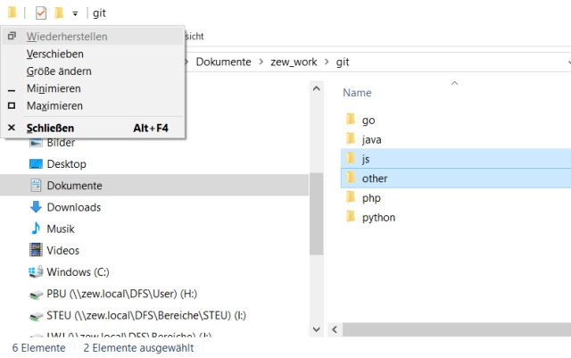
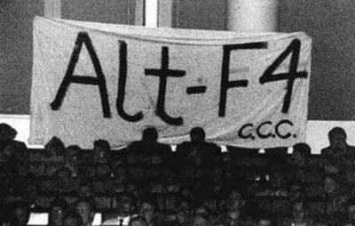

# Keyboard Shortcuts

* Windows, Web Browser and Total Commander

* [Peter Buchmann](https://pbberlin.github.io/)  
  7th December 2021

## Cut - Copy - Paste  

Letters `X-C-V` are neighbors on the keyboard

* `CTRL+X`  - Cut

* `CTRL+C`  - Copy

* `CTRL+V`  - Paste / Insert

## Usage

### Usage for text

* In Excel, Word, Notepad++, Stata Editor

### Usage for files

* in Windows Explorer

* files and icons on the Windows Desktop

* file exchange with Terminal Servers

* Even works in "Save as" dialogs

## Windows Keys

`WIN`  --  Bring up start menu

`WIN`  --  `e-x-c [Enter]`     --  Open Excel

`WIN`  --  `w-o-r [Enter]`     --  Open Word

`WIN`  --  `p-o-w [Enter]`     --  Open Powerpoint

`WIN-E`  --   Explorer

`WIN-D`  --   Desktop in den Vordergrund

`WIN-L`  --   Lock computer - (leave your desk)

`WIN-R`  --   Execute any program (mnemonic: run)

## `WIN-R`  -  Examples

`WIN-R   cmd` - command terminal

`WIN-R   excel`

`WIN-R   winword`

`WIN-R   notepad`

`WIN-R   chrome`  - or firefox...

`WIN-I   settings`

`WIN-R   taskmgr` - task manager

`WIN-R   msinfo32` - system information

### Shutdown a program without any resistance

`WIN-R   taskkill /IM chrome.exe /F`

`WIN-R   taskkill /IM outlook.exe /F`

## Web browser and tabs

These work `Firefox` and `Chrome` and most other web browsers

`CTRL-T`  -- open new tab

`CTRL-W`  -- close current tab

`CTRL-SHIFT-T`  -- re-open recently closed tab

`CTRL-L` -- cursor into address bar (for entering an URL)

`CTRL-TAB` -- next browser tab  
`CTRL-SHIFT TAB` -- previous browser tab  

`CTRL-D` -- bookmark add/edit (mnemonic a<b>D</b>d bookmark)

`CTRL-SHIFT-O` -- manage bookmarks

`CTRL-H` -- browsing history

## Desktop windows

`ALT-SPACE` -- Window menu  

<!-- For instance `ALT-SPACE X` closes the current window

 -->

`WIN-RIGHT`  --  Resize to right half of screen

`ALT-TAB`       -- Next window  
`ALT-SHIFT-TAB` -- Previous window

`ALT-F4` -- Close  

  
&nbsp; &nbsp; &nbsp; Mnemonic aid: Protest against speaker Bill Gates: 'shup up'

`CTRL-TAB` -- Next browser tab  
`CTRL-SHIFT TAB` -- Previous browser tab

Same purpose - but in MS office:  
`CTRL-F6` -- Next open word/excel document  
`CTRL-SHIFT F6` -- Previous word/excel document

`CTRL+SHIFT+ESC` -- Task manager  
requires some finger acrobatic, dubbed "ape grip"

## Outlook

`CTRL-1` -- Email - `CTRL-2` - Calender

`CTRL-N` -- New email

In recipient field: `TAB`  -- Name completion

`TAB` --  Next input field  
`SHIFT TAB` --  Previous input field  
(sender, recipient, CC, subject, body)

`ALT + S` -- Send email

`ENTER` -- Open selected email

`ESC` -- Close opened email

`CTRL-U` -- Mark selected email as unread

## Total Commander - Double commander

* `Total Commander` - more efficient than Windows Explorer

* Open source alternative: [Double commander](https://doublecmd.sourceforge.io/)
 * Same keyboard shortcuts
 * For `Windows`, `MacOS`, `Linux`
 * Supports the plugins of Total Commander

## Benefits

* All configuration stuff in a single file

* Stay on top of a huge number of directories

* Accomplish everything by keyboard

## Notebooks: Function keys mode

* `F1` , `F2`, ... have two modes
  * Either directly `F1` , `F2`, ...
  * Or the upper special function such as `Volume up` or `Brightness down`

* `Fn-Esc` inverts these modes

* Your function keys (`F1` , `F2` ...)  should be switched to _direct_ mode;

  * Press `Fn-Esc` until the small LED below `Esc` is switched _off_

## Recommended configuration settings

* Ansicht - Versteckte Dateien und Systemdateien anzeigen

* Schnellsuche: Nur Buchstaben

* Optional: Increase font size

* Optional: Diverses - Keyboard - F2 - cm_RenameOnly

* Optional: SSH Plugin (ask pbu)

* Optional: Operation - Viewer/Editor - Notepad++ oder VSCode als `F4` Editor auswählen

Einstellungen speichern

## Configuration file 

All settings are in _one_ file `wincmd.ini`.

  c:\Users\[your-windows-username]\AppData\Roaming\Ghisler\

For example, if the username is "pbu", then

  c:\Users\pbu\AppData\Roaming\Ghisler\

## Start as administrator:

`SHIFT` `F10`  -  `Als` `Administrator` `ausführen`

<!-- todo translate to English-->

## Suchen und markieren

`UP`, `DOWN` `(Pfeiltasten)` um durch die Dateiliste zu gehen

`PAGE-UP`, `PAGE-DOWN` - seitenweises blättern

`HOME` `(POS1)` und `END` - Beginn und Ende der Liste

Durch Verzeichnisse navigieren:
`BACKSPACE` - nächsthöheres Verzeichnis
`ENTER` - ins markierte Verzeichnis springen (eins tiefer)

Springen zu bestimmten Dateinamen:  mit Anfangsbuchstaben
Bspw.  
`S` `F` springt zum Verzeichnis `SFB`

Markieren mit `SPACE` (Leertaste) - Verzeichnisgrösse wird ermittelt

## Suchen und markieren II

* Markieren mit Wildcard Maske
Menü Markieren  
`ALT-M` -  `Enter`  
`GREY` `PLUS`

`antrag*.doc?`
`*klausurtagung*`

## Suchen und markieren III

Verzeichnispfad kopieren - `CTRL+P` - `RIGHT`  - `CTRL+C`

Verlassen mit `ESC`

Beispiel

Im Browser `Bild speichern unter`  
`ALT` `TAB`  `TAB` ... zum Total Commander  
`CTRL+P`  `RIGHT`  `CTRL+C`  
`ALT` `TAB`  `TAB` ... Browser  
`CTRL+V`  
`ENTER`   => wir sind im Wunschverzeichnis

Dito Word Dokument speichern unter...

## Suchen

Suchfunktionen  `ALT+F7`

Dateimaske: Alle Word oder Exceldateien, die nicht mit tmp anfangen:

    (*.doc *.docx *.xls? | tmp*.doc)

Alle Unterverzeichnisse
Auf Text durchsuchen

`Jünger` `als` `2` `Monate` -- um zuletzt geänderte Projektanträge zu finden  
`thumbs.db` auf den Projektlaufewerken finden

`Suchergebnis` `Anwenden`
ggf. Sortieren
dann Öffnen / Bearbeiten
oder nach Inhalt vergleichen (s.u.)
oder Verschieben / Löschen

## Dateiliste sortieren

* `CTRL+F4` - nach Erweiterung
* `CTRL+F3` - nach Name
* `CTRL+F5` - nach Änderungsdatum

Nochmal drücken zum Richtung umdrehen

Funktioniert auch mit Suche-Anwenden Ergebnissen

## Anzeigen - Bearbeiten

`F3` - Inhalt der Datei

`F4` - Datei mit Standard-Editor zum Bearbeiten öffnen

Um die Datei mit einem speziellen Programm zu öffnen (Adobe Acrobat Reader statt Acrobat Distiller)
`SHIFT+F10`  Kontextmenü - Öffnen mit...

## Verzeichnisse gezielt anspringen

`ALT+F1`   - Laufwerke linkes Fenster
`ALT+F2`   - Laufwerke rechtes Fenster

`ALT-DOWN` - History der Verzeichnisse aktuelles Fenster

`TAB` - wechseln zwischen linkem/rechtem Fenster

`CTRL+D`   - Favoriten anspringen - hinzufügen - bearbeiten

Rechtes Fenster angleichen
`ALT-B` -`A`  (Menüpunkt Befehle Angleichen)

## Kopieren / Verschieben zwischen Fenstern

Immer vom aktiven zum gegenüberliegenden Fenster

`F5` - Kopieren

`F6` - Bewegen

`F7` - Verzeichnis anlegen

`F8` - Löschen

`ALT+F5`  - Ausgewählte Dateien ins gegenüberliegende Fenster zippen

`CTRL+SHIFT+F5` - Shortcut im gegenüberliegenden Fenster erzeugen

Menüpunkt `Befehle` - `Fenster` `tauschen`

## Weitere I

Einzelne Datei vergleichen  
(Menüpunkt Datei - Vergleichen nach Inhalt)

Markiere zwei Dateien

`ALT-D` - `V`  

## Weitere II - Verzeichnisse synchronisieren

Verzeichnisse vergleichen
(Menüpunkt Befehle - Synchronisieren)

Zu sync`ende Verzeichnisse links und rechts einstellen

`ALT-B`- `Y`  

## Weitere III - Mehrfach-Dateien umbenennen

* Umzubenennende selektieren

`CTRL+M`  - Mehrfach-Umbenennen

* Suchen-Ersetzen im Dateinamen

* Durchnummerieren: [C]-[N]

* Nutzbar zum Bilden von Unterverzeichnis-Gruppen

## Weitere IV

* Verzeichnisgröße aufsummieren:  
Verzeichnis markieren mit `SPACE` `(Leertaste)`  
Warten
Abbrechen mit `ESC`

* Um alle Verzeichnisse auszumessen:
WinDirStat Freeware von heise.de runterladen

* `Datei` - `Dateiattribute` `ändern` - nützlich um Änderungsdatum zu ändern - um Sortierung nach zuletzt geändert semantisch zu korrigieren.

### Appendix: History of Total Commander

* For over 25 years, `Total Commander` has the most efficient concept for working with files

* Originally created as `Norton Commander` by Peter Norton

* Rebranded since 2000 as `Total Commander`

* On the linux console: `Midnight Commander`

* Fun fact: Peter Norton purchased some private love letters  
written by Jerome Salinger ("The catcher in the Rye")  
to return them unread.

